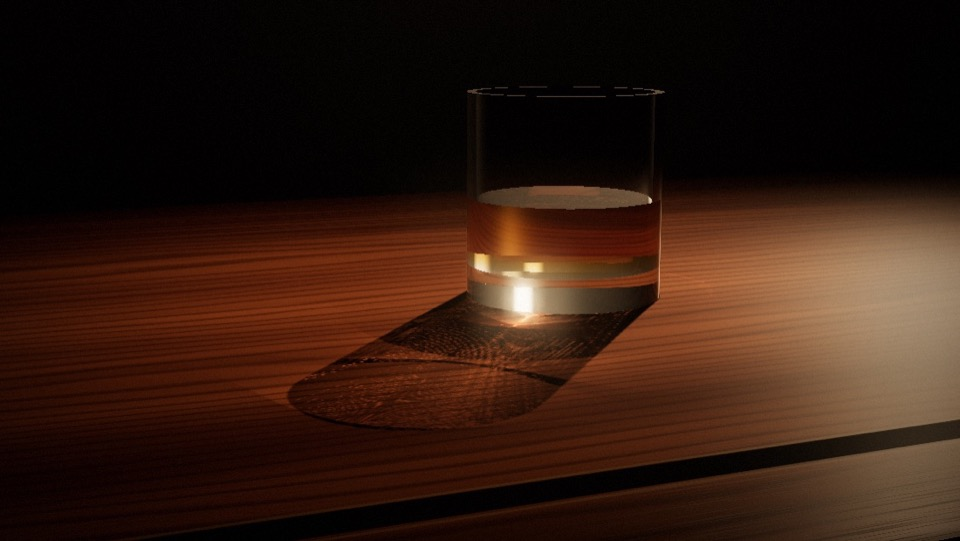

# gotoAndStop

20+ years ago gotoAndStop was my personal homepage where I would regularly post explorations of code, graphics and personal musings. I would regularly share unpolished, fun experiments. This was probably my peak enjoyment level of code. Let's try to do this all again, this time with my buddy claude. Enjoy.

A notebook of small interactive experiments, named after `gotoAndStop()` from the Flash days.
Each experiment lives in its own folder with its own `index.html`, and GitHub Pages serves them all.

**Site:** https://chanian.github.io/gotoandstop/

| # | Experiment | Live |
| --- | --- | --- |
| 01 | <br>[Whiskey Caustics](caustics/): the whiskey glass from *Final Fantasy: The Spirits Within*, with real-time caustics you can slosh around | [view](https://chanian.github.io/gotoandstop/caustics/) |

## Adding an experiment

1. Make a folder, e.g. `my-thing/`, with an `index.html`. It gets served at `/gotoandstop/my-thing/`.
2. Use relative paths for assets, and load libraries from a CDN (no build step).
3. Add a `thumb.jpg` to the folder: a 16:9 still, around 960×540. It's the landing-page card image and the
   link preview (`og:image`, which needs the absolute `https://chanian.github.io/gotoandstop/<folder>/thumb.jpg` URL).
4. Add a card to the root `index.html` with `data-frame="N"` and `/thumb.jpg">`.
   It shows up as a keyframe on the timeline.
5. Add a row to the table above, then push.

## Run locally

```sh
python3 -m http.server 8000
```

Then open http://localhost:8000.
